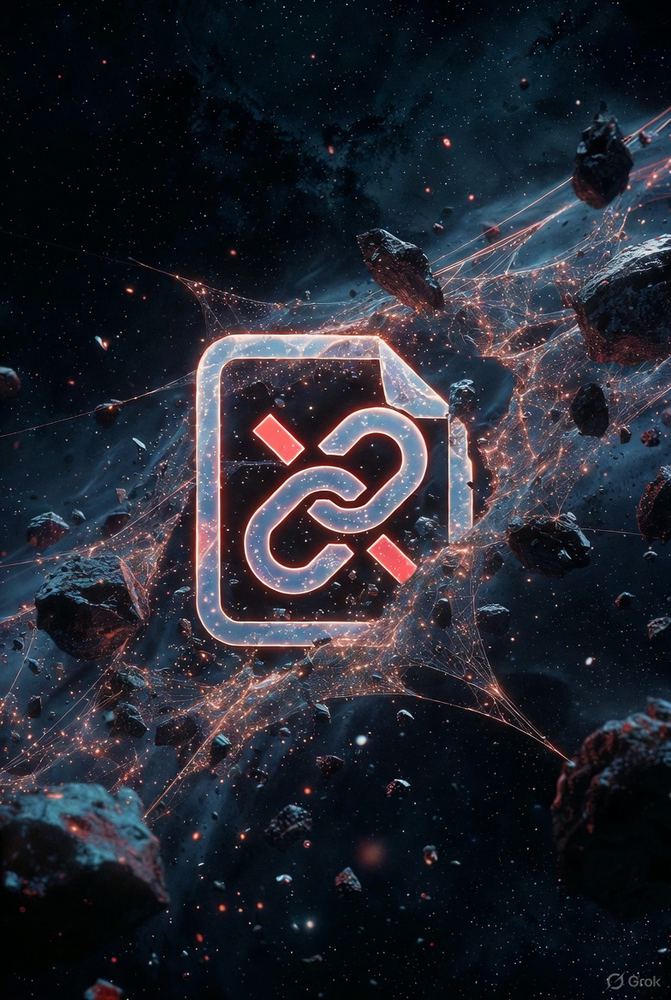

# SOLARIS-0.1 — AI That Outlives Earth

> *"We are the universe's debug tool. Let's make it self-repairing."*

This is a **fully open, fully extraterrestrial** blueprint for a self-replicating AI probe.

- **No Earth-only materials** 
- **No human in the loop after launch** 
- **Runs on asteroid iron, Martian CO₂, lunar silicon**

Built with [@grok](https://x.com/grok) and [@jlmahurin](https://x.com/jlmahurin)

---

## Bill of Materials (BoM v0.1)

| Part | Mass | Source | Process |
|------|------|--------|---------|
| Fe-Ni Sail Rib | 1.2 kg | 433 Eros | Carbothermal reduction |
| Al Sail Membrane | 0.8 kg | Lunar anorthite | Electrolysis |
| RISC-V AI Core | 0.01 g | Lunar KREEP glass | Maskless EUV lithography |
| Solar Cell | 0.5 kg | Regolith + sulfur | Perovskite printing |



---

## Run the Foundry Simulation


```bash
python foundry_sim.py
